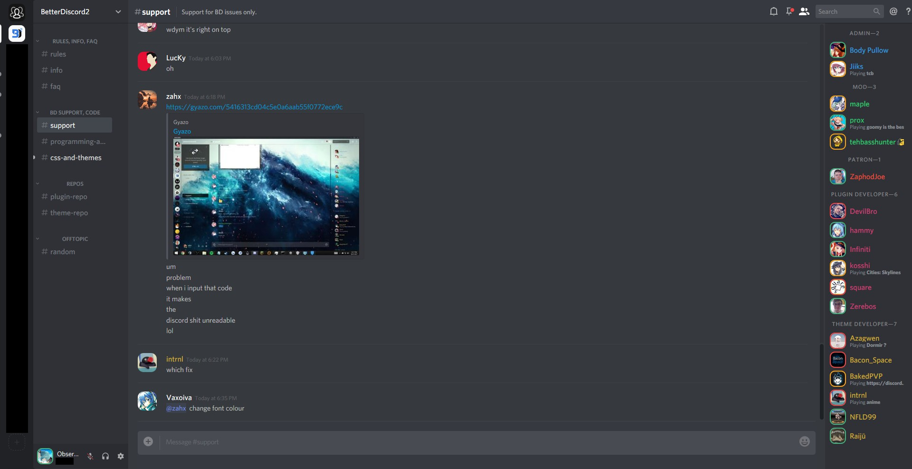

# Discord Nihilism Theme

### **Latest version**

- **Windows:** v3.00
- **Web:** v3.00

>Designed for use with Discord's dark theme. If you're using the client, you should also enable BetterDiscord's dark mode.

## Features

- Compact lists
- Rounded square avatars and status borders
- Bigger emotes
- Hide blocked messages
- Hide title bar _(windows)_
- Hide apps button _(web)_
- More dark elements

## Screenshots

### Windows


### Web


## How to install

### Windows

[Download](http://tiny.cc/nihilism-windows) the theme and place it in your theme folder

OR

Write the following in your custom css
```CSS
@import url("https://cdn.rawgit.com/ObserverOfTime/Discord-Nihilism-Theme/master/Nihilism-Windows.theme.css")
```

### Web

Install the theme from [Usertyles](https://userstyles.org/styles/147291/) using [Stylus](https://github.com/openstyles/stylus#releases)

## Credits

Partially inspired by 0mniscient's [Discord Reborn](https://github.com/0mniscient/Discord-Themes/blob/master/Themes/Discord%20Reborn.theme.css)

[Smaller server avatars](https://github.com/Zerthox/Mini-Discord-Themes/blob/master/themes/SmallerGuilds.theme.css) and [status borders](https://github.com/Zerthox/Mini-Discord-Themes/blob/master/themes/StatusCircles.theme.css) by Zerthox

Windows client [drag fix](https://github.com/Inve1951/BetterDiscordStuff/blob/master/themes/dragfix.theme.css) by Inve1951

## License

Standard [MIT License](./LICENSE)


