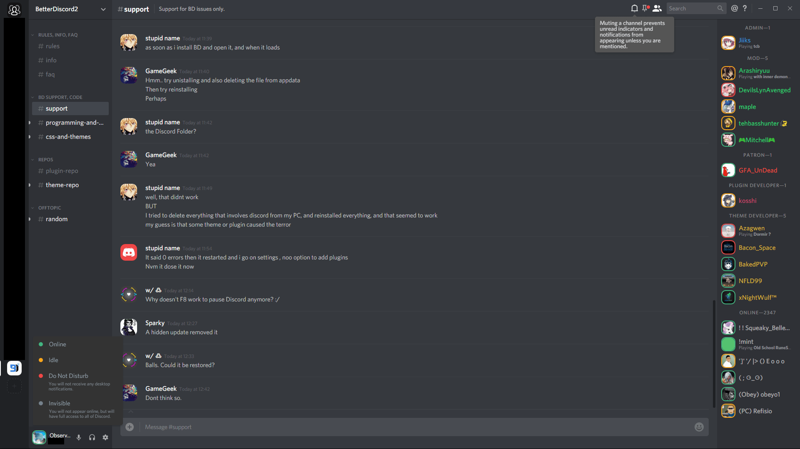
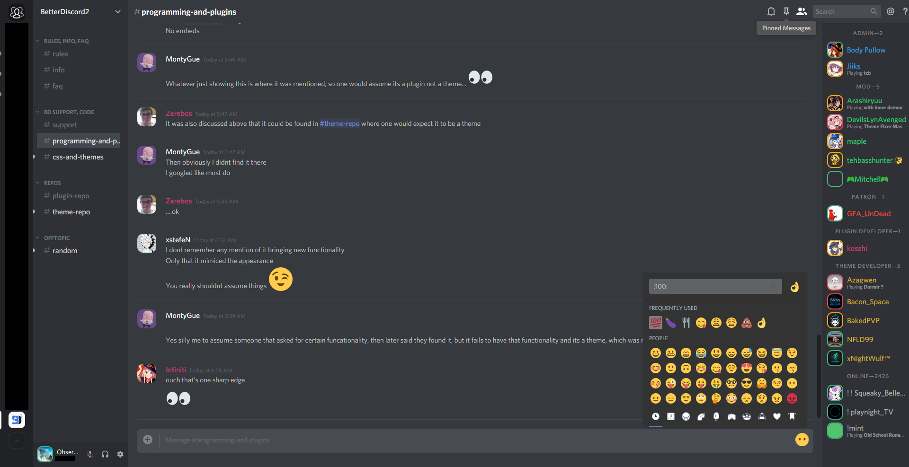
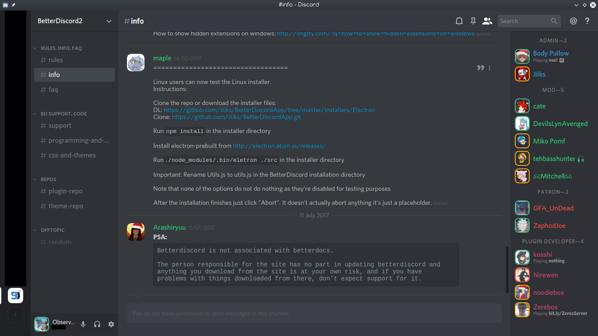

# Discord Nihilism Theme

**A darker, compact discord theme.**

>Designed for use with Discord's dark theme.

### **Latest version**

- **Windows:** v3.02
- **Web:** v3.02
- **Linux:** v3.02

## Features

- Compact lists
- Rounded square avatars and status borders
- Bigger emoji
- Hide blocked messages
- Hide title bar _(windows)_
- Hide apps button _(web)_
- Hide unnecessary scrollbars
- More dark elements

## Screenshots

### Windows

### Web

### Linux

## How to install

### Windows
- Install [BetterDiscord](https://betterdiscord.net/home/)
- [Download](http://tiny.cc/nihilism-windows) the theme and place it in BetterDiscord's theme folder _or_ write the following in your custom CSS: `@import url("https://raw.githack.com/ObserverOfTime/Discord-Nihilism-Theme/master/src/Nihilism-Windows.theme.css");`

### Web

- Install [Stylus](https://github.com/openstyles/stylus#releases) 
- Install the theme from [Usertyles](https://userstyles.org/styles/147291/) 

### Linux
- Install BetterDiscord following these [instructions](https://www.youtube.com/watch?v=h1R2NTX-6C8)
- [Download](http://tiny.cc/nihilism-linux) the theme and place it in BetterDiscord's theme folder _or_ write the following in your custom CSS: `@import url("https://raw.githack.com/ObserverOfTime/Discord-Nihilism-Theme/master/src/Nihilism-Linux.theme.css");`

## Credits

Partially inspired by 0mniscient's [Discord Reborn](https://github.com/0mniscient/Discord-Themes/blob/master/Themes/Discord%20Reborn.theme.css)

[Smaller server avatars](https://github.com/Zerthox/Mini-Discord-Themes/blob/master/themes/SmallerGuilds.theme.css) and [status borders](https://github.com/Zerthox/Mini-Discord-Themes/blob/master/themes/StatusCircles.theme.css) by Zerthox

Windows client [drag fix](https://github.com/Inve1951/BetterDiscordStuff/blob/master/themes/dragfix.theme.css) by Inve1951

## License

Standard [MIT License](./LICENSE)

