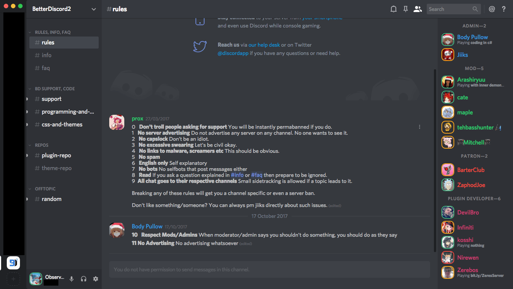

# Discord Nihilism Theme

**A dark, compact discord theme.**

**Designed for use with Discord's dark theme.**

## Latest versions

## Features

- Compact lists
- Rounded square avatars with status borders
- Bigger emoji
- Hide blocked messages
- Hide title bar _(windows)_
- Hide apps button _(web)_
- Hide unnecessary scrollbars
- More dark elements

## Screenshots

### Windows

### Web

### Linux

### Mac

## How to install

### Windows
- Install [BetterDiscord](https://github.com/rauenzi/BetterDiscordApp/releases/download/0.2.82/BetterDiscordWI.exe)
- Apply the theme
  - Option 1: [Download](https://github.com/ObserverOfTime/Discord-Nihilism-Theme/releases/download/v3.03/Nihilism-Windows.theme.css) the theme and place it in BetterDiscord's theme folder
  - Option 2: Write the following in your custom CSS (autoupdates): `@import url("https://raw.githack.com/ObserverOfTime/Discord-Nihilism-Theme/master/src/Nihilism-Windows.theme.css");`

### Web

- Install [Stylus](https://github.com/openstyles/stylus) or [Stylish](https://github.com/stylish-userstyles/stylish)
- Install the theme from [Usertyles](https://userstyles.org/styles/147291/)

### Unix
- Install BetterDiscord
  - Linux: Follow these [instructions](https://gist.github.com/ObserverOfTime/d7e60eb9aa7fe837545c8cb77cf31172)
  - Mac: Unzip and run the [installer](https://github.com/rauenzi/BetterDiscordApp/releases/download/0.2.82/BetterDiscordMacInstaller.zip)
- Apply the theme
  - Option 1: [Download](https://github.com/ObserverOfTime/Discord-Nihilism-Theme/releases/download/v3.3/Nihilism-Unix.theme.css) the theme and place it in BetterDiscord's theme folder
  - Option 2: Write the following in your custom CSS (autoupdates): `@import url("https://raw.githack.com/ObserverOfTime/Discord-Nihilism-Theme/master/src/Nihilism-Unix.theme.css");`

## TODO
- [ ] Fix status border in activities
- [ ] Clean up obsolete code
- [ ] Unjumble dark elements code
- [ ] Add more dark elements
- [x] Fix popouts

## Credits

[Smaller server avatars](https://github.com/Zerthox/Mini-Discord-Themes/blob/master/themes/SmallerGuilds.theme.css) and [status borders](https://github.com/Zerthox/Mini-Discord-Themes/blob/master/themes/StatusCircles.theme.css) by Zerthox

Windows client [drag fix](https://github.com/Inve1951/BetterDiscordStuff/blob/master/themes/dragfix.theme.css) by Inve1951

