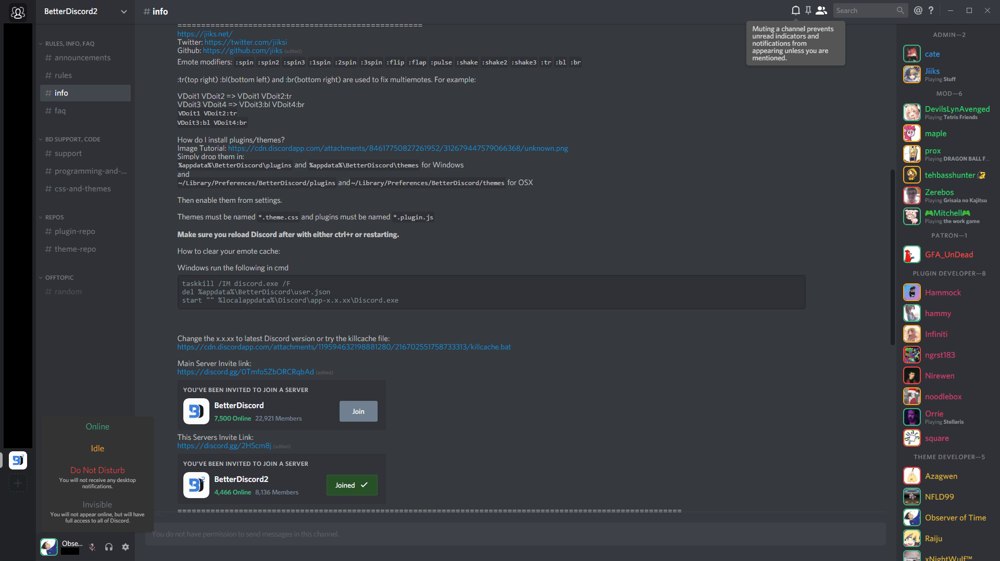
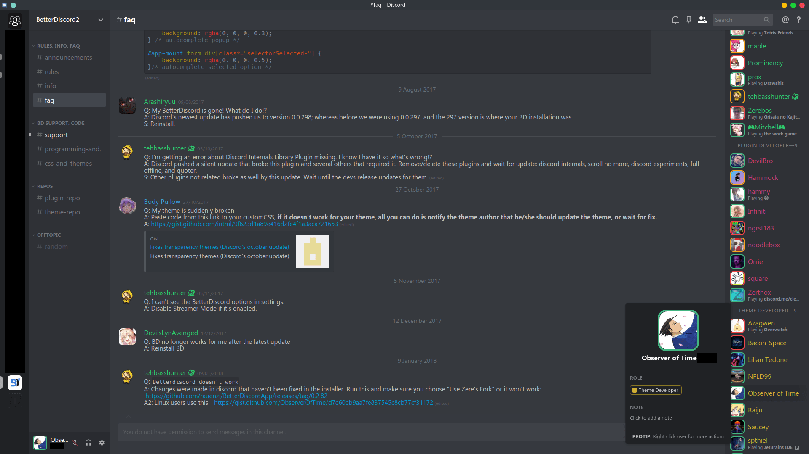

# Discord Nihilism Theme

**A darker, compact discord theme.**

**Designed for use with Discord's dark theme.**

## Latest versions

## Features
    
- Compact lists
- Rounded square avatars with status borders
- Bigger emoji
- Hide blocked messages
- Hide title bar _(windows)_
- Hide apps button _(web)_
- Hide unnecessary scrollbars
- More dark elements

## Screenshots

### Windows

### Web

### Linux

### Mac

## How to install

### Windows
- Install [BetterDiscord](https://betterdiscord.net/home/)
- Apply the theme:
  - Option 1: [Download](https://github.com/ObserverOfTime/Discord-Nihilism-Theme/releases/download/v3.02.1/Nihilism-Windows.theme.css) the theme and place it in BetterDiscord's theme folder
  - Option 2: Write the following in your custom CSS: `@import url("https://raw.githack.com/ObserverOfTime/Discord-Nihilism-Theme/master/src/Nihilism-Windows.theme.css");` (autoupdates)

### Web

- Install [Stylus](https://github.com/openstyles/stylus) or [Stylish](https://github.com/stylish-userstyles/stylish)
- Install the theme from [Usertyles](https://userstyles.org/styles/147291/) 

### Linux
- Install BetterDiscord
  - Linux: Follow these [instructions](https://www.youtube.com/watch?v=h1R2NTX-6C8)
  - Mac: Use this [installer](https://github.com/denBot/BetterDiscordOSXInstaller)
- Apply the theme
  - Option 1: [Download](https://github.com/ObserverOfTime/Discord-Nihilism-Theme/releases/download/v3.02.1/Nihilism-Unix.theme.css) the theme and place it in BetterDiscord's theme folder
  - Option 2: Write the following in your custom CSS: `@import url("https://raw.githack.com/ObserverOfTime/Discord-Nihilism-Theme/master/src/Nihilism-Unix.theme.css");` (autoupdates)

## Credits

Partially inspired by 0mniscient's [Discord Reborn](https://github.com/0mniscient/Discord-Themes/blob/master/Themes/Discord%20Reborn.theme.css)

[Smaller server avatars](https://github.com/Zerthox/Mini-Discord-Themes/blob/master/themes/SmallerGuilds.theme.css) and [status borders](https://github.com/Zerthox/Mini-Discord-Themes/blob/master/themes/StatusCircles.theme.css) by Zerthox

Windows client [drag fix](https://github.com/Inve1951/BetterDiscordStuff/blob/master/themes/dragfix.theme.css) by Inve1951

